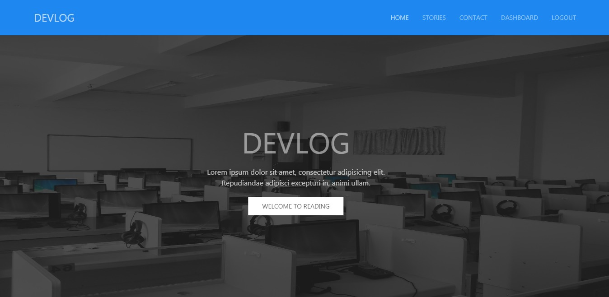
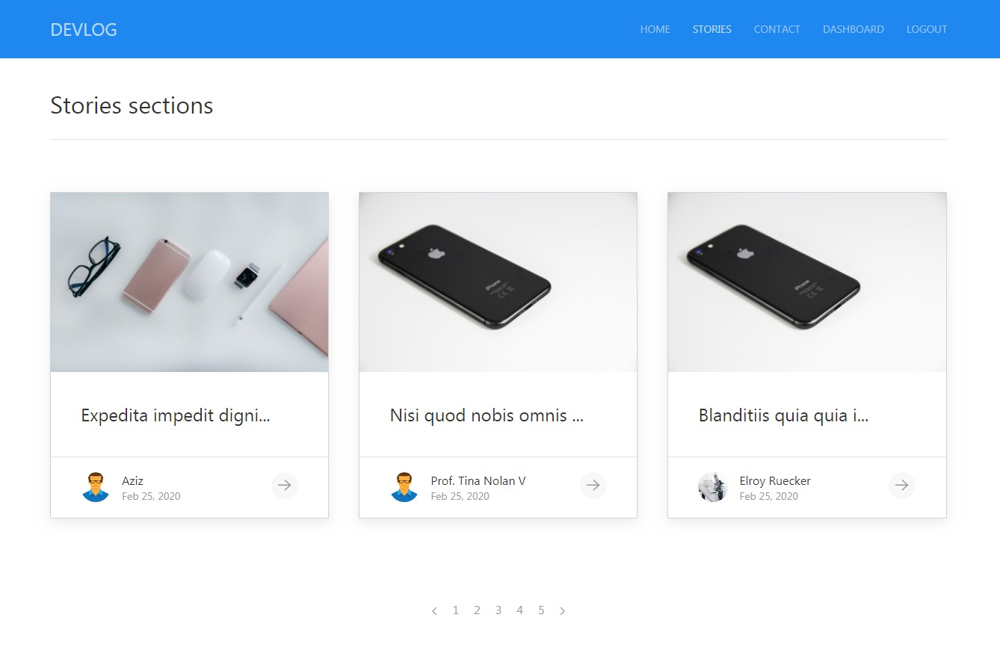
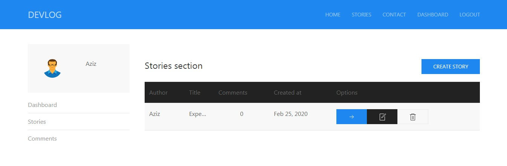

## Blog Project

A simple blog built with Laravel 6 & Vue 2

### Backend

- [Laravel Framework](https://laravel.com/docs/6.x)
- [Laravel Passport](https://laravel.com/docs/6.x/passport)
- [Image Intervetion](http://image.intervention.io/)

### Frontend

- [Vue Framework](https://vuejs.org/v2/guide/)
- [Vue Router](https://router.vuejs.org/)
- [Vuex](https://vuex.vuejs.org/)
- [Vee Validate](https://logaretm.github.io/vee-validate/overview.html)

- [UiKit](https://getuikit.com/docs/introduction)
- [Font Awesome](https://fontawesome.com/icons)

## Screenshots

